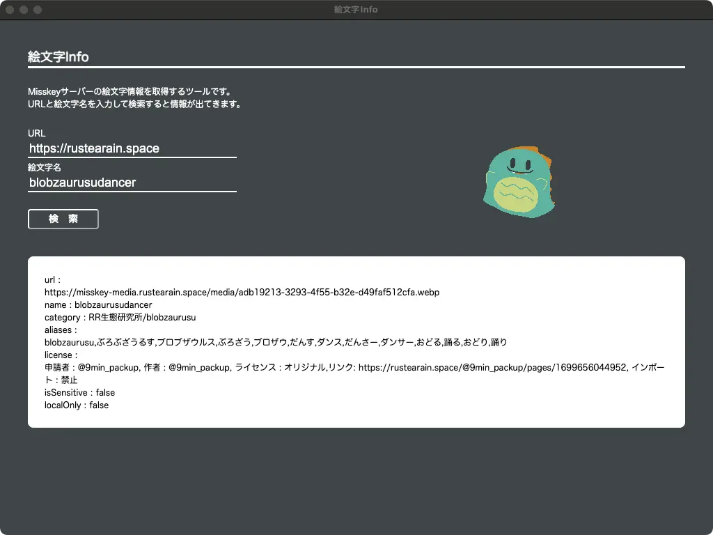

## 絵文字 Info



Misskey サーバーの絵文字情報を取得するツールです。
URL と絵文字名を入力して検索すると情報が出てきます。

### ダウンロード

以下の Rleases ページでダウンロードできます。<br>
https://github.com/9min-packup/emojiinfo/releases

対応している OS は Windows, MacOS, Linux。32bit OS には対応していません。

Electron を使用しているためアプリのファイルサイズは大きめですがご容赦ください。

### ビルド

```bash
$ npm install

# Mac
$ NODE_ENV=production node_modules/.bin/electron-builder --mac --x64
# Windows
$ NODE_ENV=production node_modules/.bin/electron-builder --win --x64
# Linux
$ NODE_ENV=production node_modules/.bin/electron-builder --linux --x64
```
